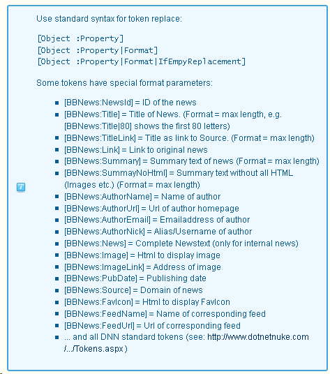

## Project Description

 The _bitboxx bbnews_ module is a DNN module for collecting and providing news on your portal. It is able to collect news from a RSS/Atom feeds or from twitter. Alternatively you can write your own news. News display is full templated and could be provided as RSS feed too. The minimum DNN Version for this module is **06.01.00** !

* * *

## Whats new ?
_Version 01.02.00 (25.03.2014):_

*   Compatibility for DNN 8+
*   Fixed some issues when retrieving Feeds
*   Added MetaData field to support XML Data in special News Field

_Version 01.01.05 (25.03.2014):_

*   Fixed a bug replacing only first url in twitter feed with a link in the news
*   Fixed a bug attaching complete html code after rss code
*   Fixed a bug when feeditem.pubdate is empty or not present

_Version 01.01.04 (20.01.2014):_

*   Twitter feeds are working again now. To get this running you need some app credentials. Create a new app on [https://dev.twitter.com/apps](https://dev.twitter.com/apps) and get your consumer and access keys and tokens. Enter these in the “Manage BBNews”-Twitter Tab.
*   Fixed some errors in the UI (DNN Form Pattern)
*   Fixed a bug not showing the correct favicon
*   Fixed an error which occured while retrieving some RSS feeds (e.g. blogs-feed on dotnetnuke.com).
*   Fixed an error with ambiguous NewsId when opening "Manage BBNews".
*   RSS icon has wrong path if DNN is installed in subdirectory
*   Added some error tolerance to parsing of RSS feeds
*   Added default values for settings "NewsInRow" and "RowsPerPage" to avoid error message if these are not set.  

* * *

## Installation

Install the module like every DNN module as a host account in System – Extensions or directly from the DNN Forge. After installation place a _bitboxx bbnews_ module on the page where you want to show the news entries.

* * *

## Module Settings


In the module settings you have 3 main options for the display:

*   The first is “Table”. That means that the news will be displayed in a tabular way. You can define how many news per row and how many rows should be displayed. (If you choose 3 news per row and 5 rows, 15 news would be shown if present). If you have more news, paging would be enabled automatically. To prevent paging, enter a number in “News Count”.
*   The second Option is “Marquee”. If you choose this option, your news are scrolling through your module with speed and direction how defined in the settings.
*   Last possible option is “Detail”. This option is for displaying only one news with its full text. A module of this type should be placed on an extra “News” page which is not included in menu. Another news module on another page with setting “Page for own news” pointing to this page shows then a list of your own news with summary text. Clicking on the link brings you to the page with the detailed news text.

The settings in detail:

<table width="493" border="1" cellspacing="0" cellpadding="2">
<tbody>
<tr>
<td width="142" valign="top">View</td>
<td width="349" valign="top">Select the style of your news display - as marquee text or as tabular templated display. Select "Detail" only if on "Page for own News"</td>
</tr>
<tr>
<td width="142" valign="top">Category</td>
<td width="349" valign="top">If you choose a category, only news from this category are shown.</td>
</tr>
<tr>
<td width="142" valign="top">News Count</td>
<td width="349" valign="top">Show only the N newest News in display. Leave empty or set zero for no limiting. You need this to suppress possible paging</td>
</tr>
<tr>
<td width="142" valign="top">Start Date</td>
<td width="349" valign="top">Show only news newer then (Date)</td>
</tr>
<tr>
<td width="142" valign="top">End Date</td>
<td width="349" valign="top">Show only news older then (Date)</td>
</tr>
<tr>
<td width="142" valign="top">Show RSS icon</td>
<td width="349" valign="top">Select if/how you want to display a RSS icon in the module title</td>
</tr>
<tr>
<td width="142" valign="top">Page for own news</td>
<td width="349" valign="top">Select a page with a _bitboxx bbnews_ module in detail-view to show own news</td>
</tr>
<tr>
<td width="142" valign="top">News per row</td>
<td width="349" valign="top">Enter the amount of News you want to see in one row</td>
</tr>
<tr>
<td width="142" valign="top">Rows per page</td>
<td width="349" valign="top">Enter the amount of rows with news per page</td>
</tr>
<tr>
<td width="142" valign="top">Select Template</td>
<td width="349" valign="top">Select a display template from the list or create a new one</td>
</tr>
<tr>
<td width="142" valign="top">Marquee Direction</td>
<td width="349" valign="top">Scroll direction for the marquee-text. "Direction = Left" scrolls from right to left(Left, Right,Up,Down)</td>
</tr>
<tr>
<td width="142" valign="top">Marquee Scroll Amount</td>
<td width="349" valign="top">Amount of pixels between 2 scroll states (Default:6)</td>
</tr>
<tr>
<td width="142" valign="top">Marquee Scroll Delay</td>
<td width="349" valign="top">Time in milliseconds between 2 scroll states (Default:85)</td>
</tr>
<tr>
<td width="142" valign="top">Marquee Alternate</td>
<td width="349" valign="top">Check if you want to have the text scrolled between left/right or top/bottom</td>
</tr>
</tbody>
</table>

* * *

## Templates

_bitboxx bbnews_ module contains the new template editor. You can select from a predefined list of templates which are shown as thumbnail. If you select “New” or “Edit”, display changes and you can edit the template text or create a new one. To support multilanguage websites, the same mimic as the resource files is used. There is one neutral template (“Shortnews.htm”). This one could only be edited by the host. If a non-host user is logged in, he can only edit the portal-specific template “Shortnews.Portal-0.htm”. If he wants to have a special template for german language, he edits the ”Shortnews.de-DE.Portals-0.htm”. When the news is shown, _bitboxx bbnews_ module looks for special portal and language versions. If none is found, the default is chosen.

##    

the template editor contains a list of all special bbnews tokens:



* * *

## Manage BBNews

In the BBNews Administration you can manage your feeds and news and how the are collected:


<table width="502" border="1" cellspacing="0" cellpadding="2">
<tbody>
<tr>
<td width="82" valign="top">Categories</td>
<td width="418" valign="top">Categories build a collection of feeds. You can have multiple feeds in one category and assign this category to a specific _bitboxx bbnews_ module . The news of all feeds in the selected category will be shown in this module.</td>
</tr>
<tr>
<td width="82" valign="top">Feeds</td>
<td width="418" valign="top">Feeds are the source for your news. You can have different types of feeds. The feed type None means that you manually write the news. Furthermore, you can still choose between a RSS / Atom feed, the Twitter timeline and the search for a keyword in Twitter.</td>
</tr>
<tr>
<td width="82" valign="top">CategoryFeeds</td>
<td width="418" valign="top">After selecting a category you are able to choose one or more from the list of your defined feeds which should belong to the this category. You can select the same feed in multiple categories!</td>
</tr>
<tr>
<td width="82" valign="top">News</td>
<td width="418" valign="top">Search news, edit saved news and / or create new news. You can hide any news from display without deleting them!</td>
</tr>
<tr>
<td width="82" valign="top">Scheduler</td>
<td width="418" valign="top">The DNN scheduler checks in the defined interval your feed table for feeds that should be refreshed. You can disable the scheduler (no new news will arrive) or edit the interval.</td>
</tr>
</tbody>
</table>

* * *

## Categories

Categories build a collection of feeds. You can have multiple feeds in one category and assign this category to a specific _bitboxx bbnews_ module . The news of all feeds in the selected category will be shown in this module.


<table width="495" border="1" cellspacing="0" cellpadding="2">
<tbody>
<tr>
<td width="120" valign="top">Category Name</td>
<td width="380" valign="top">Enter / edit the name of your category</td>
</tr>
<tr>
<td width="120" valign="top">Description</td>
<td width="380" valign="top">Enter a description for your category (will be used if category is used as outgoing RSS feed)</td>
</tr>
</tbody>
</table>

* * *

## Feeds

Feeds are the source for your news. You can have different types of feeds. The feed type None means that you manually write the news. Furthermore, you can still choose between a RSS / Atom feed, the Twitter timeline and the search for a keyword in Twitter.


<table width="500" border="1" cellspacing="0" cellpadding="2">
<tbody>
<tr>
<td width="99" valign="top">Feed Name</td>
<td width="401" valign="top">Please enter an decriptional name for your feed</td>
</tr>
<tr>
<td width="99" valign="top">Feed Type</td>
<td width="401" valign="top">Please select the type of your feed. If you want to create your own news select "none". If you want to collect news from an RSS/Atom feed or from twitter, select the corresponding entries</td>
</tr>
<tr>
<td width="99" valign="top">Feed Url</td>
<td width="401" valign="top">Please enter the feed Url (RSS/Atom-Feed) or the search term (twitter search). If "None" leave this empty.</td>
</tr>
<tr>
<td width="99" valign="top">Retrieve interval</td>
<td width="401" valign="top">Select the Interval you wish to collect information from the feed (in seconds). Zero collects feed on every hit</td>
</tr>
<tr>
<td width="99" valign="top">Try interval</td>
<td width="401" valign="top">Select the Interval when the application tries again to collect the feed after an unsuccessful try (in seconds) . Zero collects feed on every hit</td>
</tr>
<tr>
<td width="99" valign="top">Reorg interval</td>
<td width="401" valign="top">Enter the number of days passing before automatic delete. If zero, news are never deleted</td>
</tr>
<tr>
<td width="99" valign="top">Active</td>
<td width="401" valign="top">Enable / disable collection of news</td>
</tr>
<tr>
<td width="99" valign="top">Last retrieve</td>
<td width="401" valign="top">Date / time of last check</td>
</tr>
<tr>
<td width="99" valign="top">Last try</td>
<td width="401" valign="top">Date / time of last retry after collection fails</td>
</tr>
</tbody>
</table>

* * *

## CategoryFeeds

After selecting a category you are able to choose one or more from the list of your defined feeds which should belong to the this category. You can select the same feed in multiple categories!


<table width="500" border="1" cellspacing="0" cellpadding="2">
<tbody>
<tr>
<td width="97" valign="top">Category</td>
<td width="403" valign="top">Select a category first to select the corresponding feeds</td>
</tr>
<tr>
<td width="97" valign="top">Feeds</td>
<td width="403" valign="top">Select which feeds should be shown in the selected category</td>
</tr>
</tbody>
</table>

* * *

## News

Searching news, edit saved news and / or create new news. You can hide any news from display without deleting them! You can search a special news by Text, by Category and by publishing date:


Editing a news or creating a new one brings you to the following options:

<table width="500" border="1" cellspacing="0" cellpadding="2">
<tbody>
<tr>
<td width="108" valign="top">Hide</td>
<td width="392" valign="top">Check if you dont want to show this news.</td>
</tr>
<tr>
<td width="108" valign="top">Internal news</td>
<td width="392" valign="top">Check if you want to display the news on your own website.</td>
</tr>
<tr>
<td width="108" valign="top">Feed</td>
<td width="392" valign="top">Select the feed this news belongs to.</td>
</tr>
<tr>
<td width="108" valign="top">Title</td>
<td width="392" valign="top">Enter the news headline.</td>
</tr>
<tr>
<td width="108" valign="top">Publish Date</td>
<td width="392" valign="top">Date the news is published</td>
</tr>
<tr>
<td width="108" valign="top">Author</td>
<td width="392" valign="top">Name, Profile,Email + nick of author</td>
</tr>
<tr>
<td width="108" valign="top">Link</td>
<td width="392" valign="top">Source-URL of news. Leave blank if internal news.</td>
</tr>
<tr>
<td width="108" valign="top">Image</td>
<td width="392" valign="top">Enter the link to the news Image.</td>
</tr>
<tr>
<td width="108" valign="top">Summary</td>
<td width="392" valign="top">Enter the summary text of your news.</td>
</tr>
<tr>
<td width="108" valign="top">News</td>
<td width="392" valign="top">Enter the complete news (use this for internal news)</td>
</tr>
</tbody>
</table>

* * *

## Scheduler

The DNN scheduler checks in the defined interval your feed table for feeds that should be refreshed. You can disable the scheduler (no new news will arrive) or edit the interval


<table width="500" border="1" cellspacing="0" cellpadding="2">
<tbody>
<tr>
<td width="154" valign="top">Friendly Name</td>
<td width="346" valign="top">Enter a name for the scheduled job.</td>
</tr>
<tr>
<td width="154" valign="top">Schedule Enabled</td>
<td width="346" valign="top">Check to enable the schedule. A disabled schedule will  collect NO news from ANY Feed</td>
</tr>
<tr>
<td width="154" valign="top">Time Lapse</td>
<td width="346" valign="top">Example: "5" and select "Minutes" to run task every 5 minutes. Leave blank to disable timer for this task.</td>
</tr>
<tr>
<td width="154" valign="top">Retry Frequency</td>
<td width="346" valign="top">Example: "5" and select "Minutes" to retry the task every 5 minutes after a failure. Leave blank to disable retry-timer for this task.</td>
</tr>
<tr>
<td width="154" valign="top">Retain Schedule History</td>
<td width="346" valign="top">Example: Select "10" to keep the ten most recent schedule history rows.</td>
</tr>
</tbody>
</table>

## MetaData

New in version 01.02.00 for DNN8+ : The news table has a new MetaData field that is NOT filled by the RSS collector. But it can be used by other developers to fill in some xml:
```xml
<root>
   <row>
        <key>Article</key>
        <val>Lorem ipsum dolor..</val>
    </row>
    <row>
        <key>BackLink</key>
        <val>http://www.auktionsbuddy.de</val>
    </row>
    ...
</root>
```

These values can then used as placeholder tokens in the template:
[BBNEWS:Meta|Article] or [BBNEWS:Meta|Backlink]